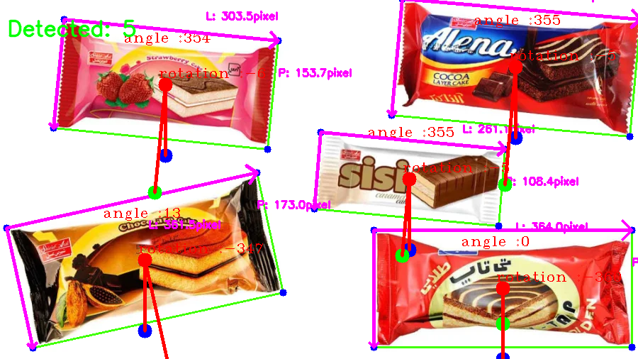

# Object Detection and Analysis using OpenCV

This project processes video input from a webcam or an image file to detect and analyze objects. It utilizes OpenCV and related libraries for contour detection, blob detection, and geometric calculations.

## Features

- **Contour Detection**: Detects objects based on contours and filters them by size.
- **Blob Detection**: Identifies and annotates blobs (distinct regions) in the image.
- **Distance and Angle Calculation**: Computes Euclidean distance and the angle of rotation for detected objects.
- **Real-time Processing**: Processes video frames in real-time or reads from an image file for analysis.
- **Visualization**: Annotates and displays processed images with contours, angles, and distances.

The processed image is displayed with detected contours, blobs, angles, and distances annotated.
Multiple windows display various stages of image processing, including binary, Canny edge detection, and final annotated output.


## Requirements

- Python 3.x
- OpenCV (`cv2`)
- NumPy (`numpy`)
- Matplotlib (`matplotlib`)
- imutils

## Installation

Install the required Python packages using pip:

```bash
pip install opencv-python numpy matplotlib imutils


